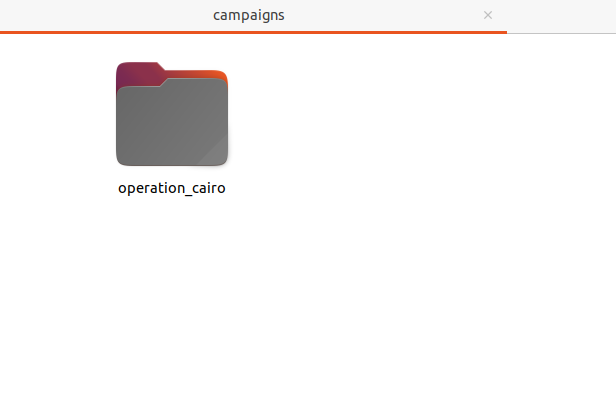
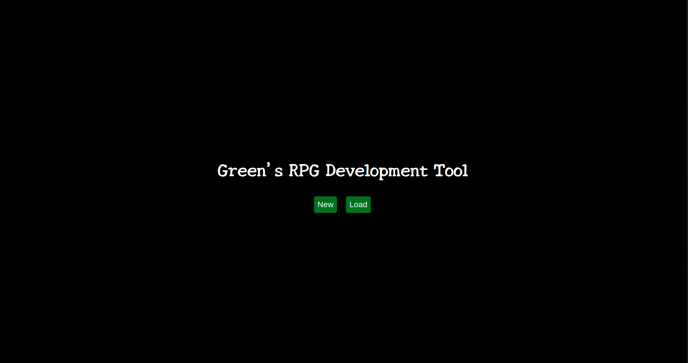
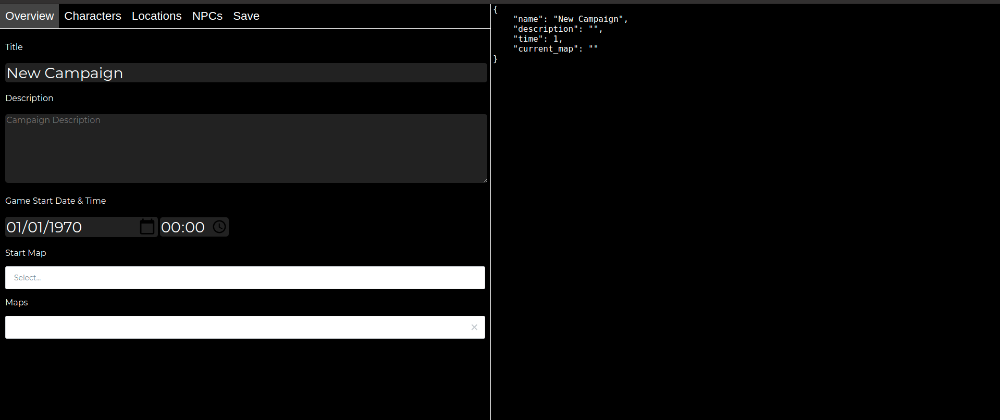
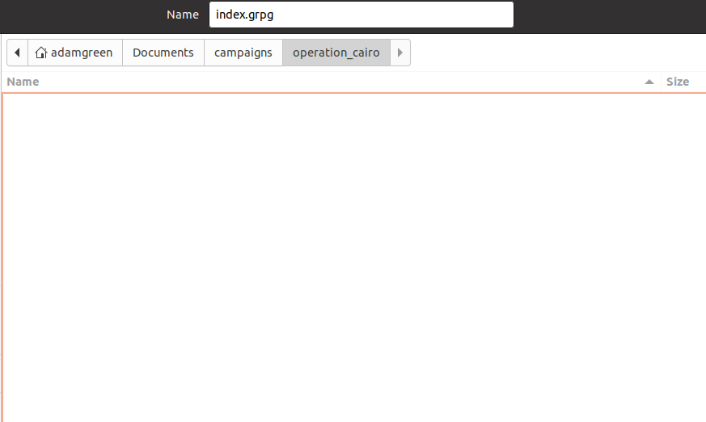

# Green's RPG Editor
[Green's RPG](https://greensrpg.com) is a free online platform for hosting and running Cypher RPGs in real-time. This editor tool is a companion tool for the hosting system to make it easier for Game Leaders to create their campaigns. It too is completely free, and comes for Mac, Windows and Linux.

## Installing

Go to the [releases page](https://github.com/nergmada/greensrpg-editor/releases) and download the version of Green's RPG for your system, most modern Windows and Linux systems are 64bit so get a 64 bit distribution. If you're using Mac then only 64bit is available.

### Windows
1. Unzip the zip folder (double click and extract)

2. Open the unzipped copy of the folder and double click "greensrpg-editor.exe"

3. Enjoy

### Mac
1. Unzip the zip folder (double click and extract)

2. Open the unzipped copy of the folder and hold the control key whilst clicking the app icon

3. Enjoy

### Linux
If y'all running linux, you know what to do

## Using

When using this tool, you should create a folder into which all your campaign assets (including music and images) are going to go. Ideally this folder will have a sensible name.

For this example I'm going to create a campaign called "Operation Cairo". I'm going to start by creating a folder called "operation_cairo" where I want to save my campaign on my computer.

Now, with Green's RPG Editor, I'm going to click "new" and create a new main file for my campaign.

Now I click the save button and save the campaign. *You should save the campaign before you start so that you can add images and music as you develop*

The main file ends in `.grpg`, you should save your campaign as `index.grpg`. 

If you upload a folder to Green's RPG that doesn't contain a `index.grpg` file, it's just going to ignore it. However, you might want to use a different name for various development stages.

Green's RPG Editor will now add some folders `assets/images` and `assets/music`.

If you have images, you should drop them into `assets/images` and if you have music you should drop them into `assets/music`. 

When you add images or music, you should click the "Reload Assets" button as this will tell the editor that you've added new assets you want to use.

## Uploading

Make sure before you upload, you save your campaign! 

You should zip the same folder you saved your index.grpg in, including the assets.

For my example above, I would zip `operation_cairo`. You can then select the "Upload Custom Campaign" option of Green's RPG.

We regularly delete campaigns from our servers, and your campaign will be publicly available, so please be conscious of uploading personal information. 

You should ideally upload your campaign right before you start play as this reduces the likelihood of us deleting a campaign before you get to play it.

Either way, you should also keep your campaign saved locally.